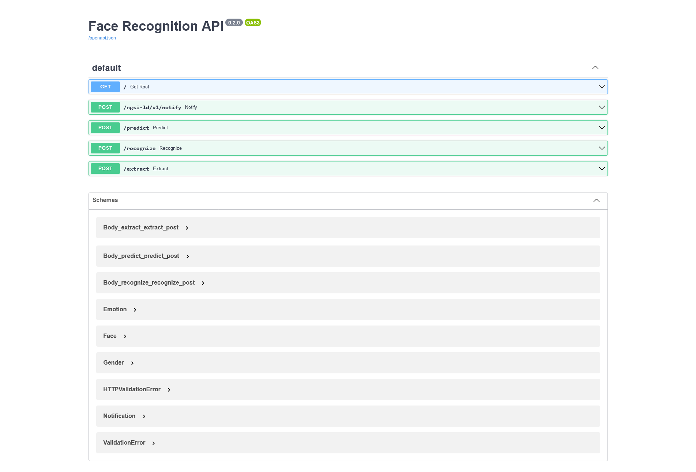
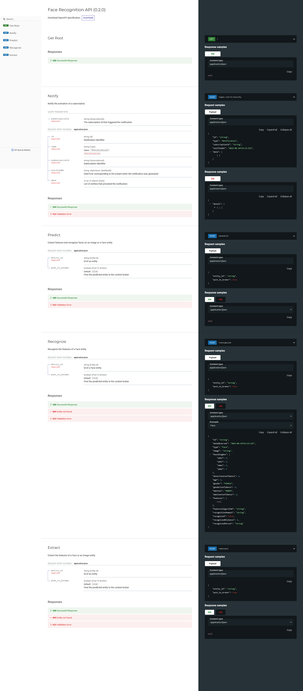

# Toolbox Projects

The Toolbox Projects are concrete implementations of some of the Toolbox components that are designed to be used by the end users or applications. They perform different types of tasks mostly related to computer vision and machine learning and can be found on [toolbox/Projects](https://github.com/CommuniCityProject/communicity_toolbox/tree/master/toolbox/Projects).

The following table lists the currently provided Projects:

| Name                                                           | Description   |
|----------------------------------------------------------------|---------------|
| [FaceDetection](../toolbox/Projects/FaceDetection/README.md)              | Detect faces on images |
| [FaceRecognition](../toolbox/Projects/FaceRecognition/README.md)           | Detect and extract features of faces, create a facial dataset and recognize faces |
| [AgeGender](../toolbox/Projects/AgeGender/README.md)                       | Detect faces, predicts their gender and estimate their age |
| [InstanceSegmentation](../toolbox/Projects/InstanceSegmentation/README.md) | Performs instance segmentation on images |
| [Keypoints](../toolbox/Projects/Keypoints/README.md)                       | Predicts the position of body key points |
| [FaceEmotions](../toolbox/Projects/FaceEmotions/README.md)                 | Classify different types of face expressions |
| [ImageStorage](../toolbox/Projects/ImageStorage/README.md)                 | API to upload and download images and visualize the data generated by the Toolbox |
| [FrontEnd](../toolbox/Projects/FrontEnd/README.md)                 | Web UI to showcase the Toolbox Project APIs and components |

<!-- Projects offer the following components:
 - A class that performs the task for which it has been designed and that can be imported as a Python module and used in other applications.
 - A configuration YAML file that defines the parameters of the Project and its components.
 - An API REST module that allows calling the project's main functionalities.
 - A ``demo.py`` script that allows the execution of the Project through command lines. -->

## API REST

Projects are intended to be used by the final users or applications through their own APIs. They are developed using the [FastApi](https://fastapi.tiangolo.com/) Python framework which has some key features such as:
- Automatic documentation generation.
- Automatic type validation using Pydantic.
- Based on open standards like OpenAPI and JSON Schema.
- Asynchronous calls.
- Production-ready with Uvicorn server.

They work in conjunction with a context broker, which acts as a mediator between the Projects and the data sources. The input data is received from the context broker, which is then processed to generate an output that is posted back to the context broker. The generated data uses the [NGSI-LD](https://www.etsi.org/deliver/etsi_gs/CIM/001_099/009/01.06.01_60/gs_cim009v010601p.pdf) format and follows the [data models](DataModels/README.md) defined by the Toolbox. This approach enables an efficient way of retrieving and publishing data, utilizing a well-known standard and unifying the output of each component on a single common endpoint.

<!-- 
To launch an API we can call the ``api.py`` file located on the Project's directory. To see the accepted parameters we can use the `--help` option:
```
python api.py --help
```
```
usage: api.py [-h] [--config CONFIG] [--log-level {DEBUG,INFO,WARN,ERROR,CRITICAL}]

optional arguments:
  -h, --help            show this help message and exit
  --config CONFIG       Path to the configuration yaml (default: 'config.yaml')
  --log-level {DEBUG,INFO,WARN,ERROR,CRITICAL}
                        Log level (default: INFO)
```

To start the API we can call:
```
python api.py
```

The API will be available on the port specified on the configuration YAML. -->

The API supports automatic and interactive documentation generation with [swagger-ui](https://github.com/swagger-api/swagger-ui) and [redoc](https://github.com/Redocly/redoc). They are available by default on  http://127.0.0.1:8080/docs and http://127.0.0.1:8080/redoc respectively.

<details>
  <summary>Screenshots</summary>
  <h3>swagger-ui</h3>

  

  <h3>redoc</h3>
  
  

</details>

</br>
<!-- 
The APIs related to image processing usually implements the following routes:
- ``/ngsi-ld/v1/notify`` [POST]: allow to notify a subscription from the context broker. This will be the endpoint specified on the creation of the subscription. The notified entities will be processed by the API and optionally a subsequent entity will be created or updated with the results of the Project.
- ``/predict`` [POST]: executes the main functionality of the Project. As the request body, it receives a JSON with the ID of an entity on the context broker. Depending on the Project this entity could be an Image or another accepted data model. The project will process the entity and optionally will update or create a new entity on the context broker. The API will respond with a list of created or modified entities. With the `accept` request header we can specify the output format of the API. This can be ``application/json`` or ``application/ld+json`` for an NGSI-LD JSON. -->

## Configuration YAML

Projects use a configuration YAML file to define their parameters. On each Project folder is a ``config.yaml`` file with the default values.

The configuration system allow overriding other configuration YAMLs with the field ``__BASE__``. It also allows inserting values from the environment variables, using the keyword ``!ENV`` before the value and encapsulating the variable name in ``${...}``. (e.g. ``notification_uri: !ENV http://${HOST}:${PORT}/ngsi-ld/v1/notify``)

<!-- 

Projects follow a similar configuration structure.
As an example, the configuration for the [AgeGender](../toolbox/Projects/AgeGender/README.md) Project could look like this:

<details>
  <summary>config.yaml</summary>

```
  age_gender:
    model_name: age_gender
    params:
      age_model_path: ../../../data/models/age_gender/age_model.onnx
      gender_model_path: ../../../data/models/age_gender/gender_model.onnx
      do_age: True
      do_gender: True
      use_cuda: False

  face_detector:
    face_box_scale: 1.2
    model_name: face_detector_retinaface
    params:
      weights_path: ../../../data/models/face_detector_retinaface/Resnet50_Final.pth
      model_name: resnet50
      confidence_threshold: 0.7
      landmarks: False
      nms_threshold: 0.4
      use_cuda: False

  context_broker:
    host: 192.168.0.100
    port: 1026
    notification_uri: http://192.168.0.100:9002/ngsi-ld/v1/notify

  api:
    host: 0.0.0.0
    port: 8080
    allowed_origins: []
    local_image_storage: False
    post_new_entity: False
    update_entity: True

  subscriptions:
    - entity_type: Image
      watched_attributes: ["purpose"]
      query: "purpose==%22AgeGender%22"
    - entity_type: Face
      watched_attributes: ["dateCreated"]
      query: ""

  visualization:
    image_width: 1500
    Face: {}
```


</details> -->

<!-- Here, both ``age_gender`` and ``face_detector`` fields define the parameters for the age-and-gender and the face-detector machine learning models respectively. Inside these fields, we find the ``model_name`` parameter which defines the name of the machine learning model to be used, whereas ``params`` define the specific parameters of that model. Different models of the same domain can be used by only changing its name and parameters. A list of the provided machine learning models can be found [here](machine-learning-models.md)

The ``context_broker`` field defines the address to a context broker server (``host`` and ``port``). The ``notification_uri`` is the URI where the context broker should send the subscription notifications (if any), that is the address where the service is running. These addresses are used by the API and the ``demo.py`` script.

The ``api`` field contains the parameters used by the API service. Here is defined the bind host and port of the server. ``allowed_origins`` allow defining the origins that should be permitted to make cross-origin requests. ``local_image_storage`` indicates if the project can retrieve the images to process from a local file path or it must retrieve them online by its URL. This is useful when the Project is being used in conjunction with the Toolbox [ImageStorage](../toolbox/Projects/ImageStorage/README.md) API on the same machine, so images can be read from disk instead of by its URL. Finally, `post_new_entity` and `update_entity` indicate if, in the case of processing an existing entity on the context broker, a new entity should be created or if the source entity should be modified with the generated output.

The ``subscriptions`` field defines the subscriptions that the service will create on the context broker. None or multiple subscriptions can be created, specifying the entity type, watched attributes and a query, where only the entity type value is required. These subscriptions will be deleted once the service stops.
The ``subscriptions`` field is used by the API and the ``demo.py`` script.
The ``context_broker.notification_uri`` is used as the endpoint where send the notifications. The API service defines the notification route to ``ngsi-ld/v1/notify``, whereas the demo uses the specified route.

Finally, the ``visualization`` field allows to define the visualization parameters when we want to create an image with some data models visualized. Here we can set the ``image_width`` and/or ``image_height`` fields that will define the output image size. If only one is set, the image aspect ratio will be maintained. Also, visualization parameters for each data model type can be set. This values will override the defaults ones defined on [toolbox/Visualization/Defaults.py](../toolbox/Visualization/Defaults.py).
These values are used by the ``demo.py`` script and by the [ImageStorage](../toolbox/Projects/ImageStorage/README.md). -->


## demo.py

Projects related to image processing include a ``demo.py`` script that allows running the Project from the command line and trying its base functionalities.

To see the accepted arguments use the ``--help`` option:
```
python demo.py --help
```
```
usage: demo.py [-h] [-c CONFIG] {local,producer,consumer,visualize} ...

optional arguments:
  -h, --help            show this help message and exit
  -c CONFIG, --config CONFIG
                        Path to the configuration YAML (default 'config.yaml')

task:
  {local,producer,consumer,visualize}
    local               Run the project locally
    producer            "Run the project on images and upload the results to a context broker
    consumer            Retrieve and parse entities from a context broker
    visualize           Visualize an entity from the context broker
```

The demo usually has four main modes or tasks specified as the first parameter:
- _local_: Runs the Project without a context broker, shows the results and optionally saves an output image:
  ```
  python demo.py local --help
  ```
  ```
  usage: demo.py local [-h] -i IMAGE [-o OUTPUT]

  optional arguments:
    -h, --help            show this help message and exit
    -i IMAGE, --image IMAGE
                          Path or URL to an image or folder with images
    -o OUTPUT, --output OUTPUT
                          Optional output image file path when running a single image or an output folder when running on multiple images
  ```
  Example:
  ```
  python demo.py local -i ../../../data/samples/images/general/faces_00.jpg -o output.jpg
  ```

- _producer_: Posts the Project output to the context broker:
  ```
  python demo.py producer --help
  ```
  ```
  usage: demo.py producer [-h] -i IMAGE

  optional arguments:
    -h, --help            show this help message and exit
    -i IMAGE, --image IMAGE
                          Path or URL to an image or folder with images
  ```
  Example:
  ```
  python demo.py producer -i ../../../data/samples/images/general/faces_00.jpg
  ```

- _consumer_: Retrieves a single entity from the context broker or subscribes to it and processes the data:
  ```
  python demo.py consumer --help
  ```
  ```
  usage: demo.py consumer [-h] [-i ID] [-s] [--post-to-broker]

  optional arguments:
    -h, --help        show this help message and exit
    -i ID, --id ID    Optional entity ID
    -s, --subscribe   Subscribe to the context broker with the subscriptions in the config
    --post-to-broker  Post the consumed entities to the context broker
  ```
  Example:
  ```
  python demo.py consumer -i urn:ngsi-ld:Image:mMPzYd3PEe2xkn0DPT8lZA
  ```

- _visualize_: Visualizes an existing entity in the context broker:
  ```
  python demo.py visualize --help
  ```
  ```
  usage: demo.py visualize [-h] -i ID [--image IMAGE] -o OUTPUT

  optional arguments:
    -h, --help            show this help message and exit
    -i ID, --id ID        Entity ID
    --image IMAGE         Optional image file where draw the retrieved entity. If not set, it will try to get the image by its ID
    -o OUTPUT, --output OUTPUT
                          Output image file path
  ```
  Example:
  ```
  python demo.py visualize -i Face:vdNSGeAtEe2RsjCcI__G6g --image ../../../data/samples/images/general/faces_00.jpg -o output.jpg
  ```
