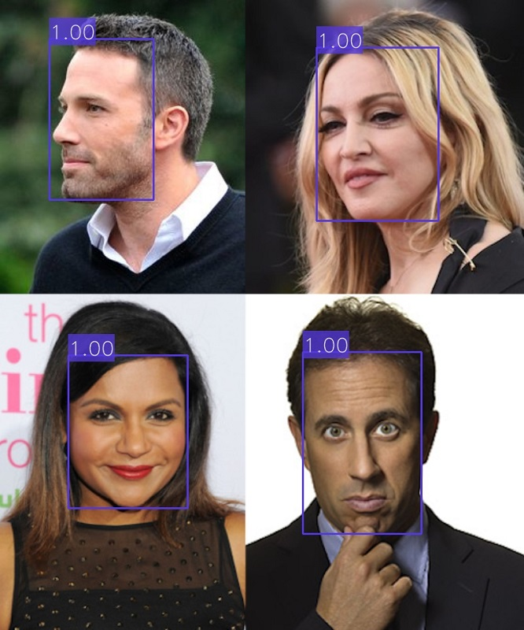

# Face Detection

This Project aims to detect faces in images.



## Data models

This project uses the _[Face](https://github.com/CommuniCityProject/communicity_toolbox/tree/master/docs/DataModels/Face)_ data model.

## Configuration

This project uses a configuration YAML with the following fields:

- ``face_detector``: Specifies the name and parameters of the face detection model. It must have the following fields:
  - ``model_name``: Name of the model.
  - ``params``: The parameters of the models' python class.
- ``context_broker``:
    - ``host``: IP address of the Context Broker.
    - ``port``: Port of the Context Broker.
    - ``notification_uri``: URI where the subscription notifications will be sent.
    - ``check_subscription_conflicts``: Flag if the subscription conflicts should be checked before creating them.
- ``api``:
    - ``host``: Bind IP address of the API server.
    - ``port``: Bind port of the API server.
    - ``allowed_origins``: List of origins that should be permitted to make cross-origin requests.
    - ``local_image_storage``: Flags if the images are stored locally and can be accessed by their path or must be retrieved from a URL.
- ``subscriptions``: List of subscriptions to create on the context broker. Each element can have the following fields:
    - ``entity_type``: Entity type to subscribe to.
    - ``watched_attributes``: List of attributes to subscribe to.
    - ``query``: Query to filter the entities to subscribe to.

<details>
<summary>Example:</summary>

```
face_detector:
  model_name: face_detector_retinaface
  params:
    weights_path: ../../../data/models/face_detector_retinaface/Resnet50_Final.pth
    model_name: resnet50
    confidence_threshold: 0.7
    landmarks: False
    nms_threshold: 0.4
    use_cuda: False

context_broker:
  host: 192.168.0.100
  port: 1026
  notification_uri: http://192.168.0.100:8080/ngsi-ld/v1/notify
  check_subscription_conflicts: True

api:
  host: 0.0.0.0
  port: 8080
  allowed_origins: []
  local_image_storage: True

subscriptions:
  - entity_type: Image
    watched_attributes: ["purpose"]
    query: "purpose==%22FaceDetection%22"
```

</details>

## API

The API allows the Project to be executed as a service. It has automatic and interactive documentation generated with [swagger-ui](https://github.com/swagger-api/swagger-ui) on ``/docs`` and [redoc](https://github.com/Redocly/redoc) on ``/redoc``.

### Endpoints

- **``GET``** _/_

    Returns the name and version of the API.

    - **Response**

        <details>
        <summary>application/json</summary>

        ```
        {
          "title": "Face Detection API",
          "version": "0.2.0"
        }
        ```

    </details>

- **``POST``** _/predict_

    Predict bounding boxes of the faces in an image. It returns a list of data models for each detected face. The response type can be specified with the ``accept`` header (``application/json`` or ``application/ld+json``).

    - **Request body**

        A JSON with the following fields:

        - ``entity_id``: The id of an image entity in the context broker to perform face detection on.
        - ``post_to_broker``: Flag if the generated data models should be posted to the context broker. Defaults to ``true``.
      
        </br>
        <details>
        <summary>application/json</summary>

        ```
        {
          "entity_id": "string",
          "post_to_broker": true
        }
        ```

    </details>

    - **Response**
    
      A list with the generated data models (one for each face) with the following fields:

      - ``id``: The id of the entity on the context broker.
      - ``dateObserved``: The date when the data model was generated.
      - ``type``: The type of the data model (``Face``).
      - ``image``: The id of the source image entity.
      - ``boundingBox``: The bounding box of the face in the image with relative image coordinates.
      - ``detectionConfidence``: The confidence of the detection.

      </br>
      <details>
      <summary>application/json</summary>

      ```
      [
        {
          "id": "urn:ngsi-ld:Face:H86LoussEe28ohtRGIBEXw",
          "dateObserved": "2023-05-05T10:03:46.306881",
          "type": "Face",
          "image": "urn:ngsi-ld:Image:bw97--NbzigD_jXd979yUpZCBTMOXZ0pdlnUKC5L-pw",
          "boundingBox": {
            "xmin": 0.66875,
            "ymin": 0.21481481481481482,
            "xmax": 0.7505208333333333,
            "ymax": 0.40185185185185185
          },
          "detectionConfidence": 0.9998043179512024,
          "age": null,
          "gender": null,
          "genderConfidence": null,
          "emotion": null,
          "emotionConfidence": null,
          "features": null,
          "featuresAlgorithm": null,
          "recognitionDomain": null,
          "recognized": false,
          "recognizedDistance": null,
          "recognizedPerson": null
        }
      ]
      ```
      </details>
    
      <details>
      <summary>application/ld+json</summary>

      ```
      [
        {
          "id": "urn:ngsi-ld:Face:qWLNOussEe2U6BtRGIBEXw",
          "type": "Face",
          "@context": [
            "https://uri.etsi.org/ngsi-ld/v1/ngsi-ld-core-context.jsonld"
          ],
          "dateObserved": {
            "type": "Property",
            "value": {
              "@type": "DateTime",
              "@value": "2023-05-05T10:07:37Z"
            }
          },
          "image": {
            "type": "Relationship",
            "object": "urn:ngsi-ld:Image:bw97--NbzigD_jXd979yUpZCBTMOXZ0pdlnUKC5L-pw"
          },
          "boundingBox": {
            "type": "Property",
            "value": {
              "xmin": 0.66875,
              "ymin": 0.21481481481481482,
              "xmax": 0.7505208333333333,
              "ymax": 0.40185185185185185
            }
          },
          "detectionConfidence": {
            "type": "Property",
            "value": 0.9998043179512024
          },
          "recognized": {
            "type": "Property",
            "value": false
          },
          "dateModified": {
            "type": "Property",
            "value": {
              "@type": "DateTime",
              "@value": "2023-05-05T10:07:37Z"
            }
          },
          "dateCreated": {
            "type": "Property",
            "value": {
              "@type": "DateTime",
              "@value": "2023-05-05T10:07:37Z"
            }
          }
        }
      ]
      ```
      </details>

- **``POST``** _/ngsi-ld/v1/notify_
  
  Route to notify the activation of a subscription from a context broker.

  - **Query parameters**
    
    ``subscriptionId``: The id of the subscription.

  - **Request body**

      A JSON with the following fields:

      - ``id``:  The id of the notification.
      - ``type``:  ``Notification``.
      - ``subscriptionId``:  The id of the subscription.
      - ``notifiedAt``:  The date when the notification was sent.
      - ``data``:  A list with the entities notified.
    
      </br>
      <details>
      <summary>application/json</summary>

      ```
      {
        "id": "string",
        "type": "Notification",
        "subscriptionId": "string",
        "notifiedAt": "string",
        "data": []
      }
      ```

    </details>

  - **Response**

    ``204`` _no content_: If the notification was processed successfully.
    