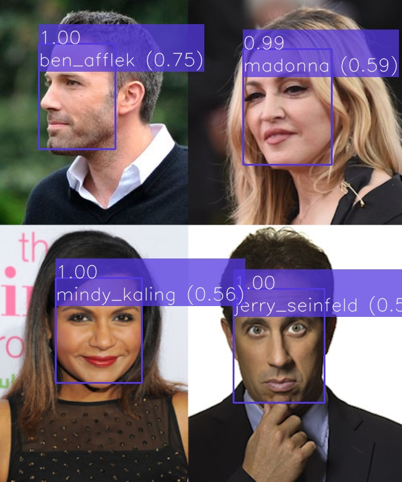

# Face Recognition

This Project aims to perform face recognition in images. This process can be split in two main tasks:
The first one uses a machine learning model to extract face features from images, which are vectors that represent faces in a high dimensional space.
The second one uses this features to compare them with a previously created dataset of known faces and find the most similar one.

This project allows to detect faces, extract its features, recognize people and also to create a dataset from a set of images of known people.

The process of features extraction and face recognition can be done separately on different process/machines.



## Data models

This project uses the _[Face](https://github.com/CommuniCityProject/communicity_toolbox/tree/master/docs/DataModels/Face)_ data model.

## Configuration

This project uses a configuration YAML with the following fields:

- ``face_recognition``: Specifies the name and parameters of the face recognition model. It must have the following fields:
    - ``model_name``: Name of the model.
    - ``params``: The parameters of the models' python class.
    - ``dataset_path``: Path to the dataset of faces.
    - ``unknown_label``: Label to use for unknown faces.
    - ``domain``: Domain of the dataset. i.e. the name of the group of people to recognize.
- ``face_detector``: Specifies the name and parameters of the face detector model. It must have the following fields:
    - ``model_name``: Name of the model.
    - ``params``: The parameters of the models' python class.
- ``context_broker``:
    - ``host``: IP address of the Context Broker.
    - ``port``: Port of the Context Broker.
    - ``notification_uri``: URI where the subscription notifications will be sent.
    - ``check_subscription_conflicts``: Flag if the subscription conflicts should be checked before creating them.
- ``api``:
    - ``host``: Bind IP address of the API server.
    - ``port``: Bind port of the API server.
    - ``allowed_origins``: List of origins that should be permitted to make cross-origin requests.
    - ``local_image_storage``: Flags if the images are stored locally and can be accessed by their path or must be retrieved from a URL.
    - ``post_new_entity``: Create a new _Face_ entity in the context broker with the predicted emotion when processing a _Face_ entity.
    - ``update_entity``: Update the _Face_ entity in the context broker with the predicted emotion when processing a _Face_ entity.
    - ``load_dataset``: Flag if the face recognition dataset should be loaded.
    - ``do_feature_extraction``: Flag if the face features should be extracted from the detected faces.
    - ``do_feature_recognition``: Flag if the face features should be used to recognize people.
- ``subscriptions``: List of subscriptions to create on the context broker. Each element can have the following fields:
    - ``entity_type``: Entity type to subscribe to.
    - ``watched_attributes``: List of attributes to subscribe to.
    - ``query``: Query to filter the entities to subscribe to.

<details>
<summary>Example:</summary>

```
face_recognition:
  model_name: face_recognition_facenet
  params:
    distance_threshold: 0.75
    model_path: ../../../data/models/face_recognition_facenet/squeezenet_VGGFace2/model-20180204-160909.ckpt-266000
    use_cuda: False
  dataset_path: ../../../data/samples/face_recognition_datasets/facenet_celeb_single.pkl
  unknown_label: "<unk>"
  domain: Celeb

face_detector:
  model_name: face_detector_retinaface
  params:
    weights_path: ../../../data/models/face_detector_retinaface/Resnet50_Final.pth
    model_name: resnet50
    confidence_threshold: 0.7
    landmarks: False
    nms_threshold: 0.4
    use_cuda: False

context_broker:
  host: 192.168.0.100
  port: 1026
  notification_uri: http://192.168.0.100:8080/ngsi-ld/v1/notify
  check_subscription_conflicts: True

api:
  host: 0.0.0.0
  port: 8080
  allowed_origins: []
  local_image_storage: True
  post_new_entity: False
  update_entity: True
  load_dataset: True
  do_feature_extraction: True
  do_feature_recognition: True

subscriptions:
  - entity_type: Face
    watched_attributes: ["recognized"]
    query: "recognized==false"
  - entity_type: Image
    watched_attributes: ["purpose"]
    query: "purpose==%22FaceRecognition%22"
```

</details>

## Dataset creation

This Project allows to create a dataset of face features from a set of images of known people. 

- Preparation:
    
    The images must be stored in a folder, with one image per person and the name of the file must be the name (or id) of the person. It is possible to set an NGSI URN as the filename by replacing the ``:`` with ``;``. In each image only one face must be visible.

- Dataset creation:

    The dataset can be created using the ``dataset_creator.py`` script. The ``--help`` option can be used to get the list of accepted arguments:
    ```
    python .\dataset_creator.py --help
    ```
    ```
    usage: dataset_creator.py [-h] [-c CONFIG] -i IMAGES [-d DATASET] -o OUTPUT

    Create a face recognition dataset with a set of images. There should be one image for each person. The filename will be used as its name or id (';' are replaced with ':'). Images must contain only one face.

    optional arguments:
      -h, --help            show this help message and exit
      -c CONFIG, --config CONFIG
                            Path to the configuration yaml (default 'config.yaml')
      -i IMAGES, --images IMAGES
                            Path to an image or images folder. The filename of each image will be its name or id. ';' are replaced with ':'
      -d DATASET, --dataset DATASET
                            Path to a dataset pickle file, to load and combine with the current images
      -o OUTPUT, --output OUTPUT
                            Output pickle file to save the dataset
    ```
    
    We can create the dataset with the following command:
    ```
    python .\dataset_creator.py -i /path/to/the/images/ -o /output/dataset/file.pkl
    ```

    A pickle file will be created with the dataset. It will contain the features associated with each name/id. The images are not stored in the dataset.

    With the ``--dataset`` option we can load a previous dataset and combine it with the new images. This is useful to add new people to an existing dataset.

- Usage:

    To use the created dataset it is only necessary to set the ``dataset_path`` parameter in the configuration file to the path of the pickle file.
    

## API

The API allows the Project to be executed as a service. It has automatic and interactive documentation generated with [swagger-ui](https://github.com/swagger-api/swagger-ui) on ``/docs`` and [redoc](https://github.com/Redocly/redoc) on ``/redoc``.


### Endpoints

- **``GET``** _/_

    Returns the name and version of the API.

    - **Response**

      <details>
      <summary>application/json</summary>

      ```
      {
        "title": "Face Recognition API",
        "version": "0.2.0"
      }
      ```

    </details>

- **``POST``** _/predict_
    
    If an image entity is provided, it predicts the position (bounding box) of faces in the image and recognize them. If a _Face_ entity is provided, it uses the existing bounding box to get an image of the face and recognize it.

    This route is only available if ``do_feature_extraction`` and ``do_feature_recognition`` are set to ``true``.
    
    It returns a list of data models for each detection. The response type can be specified with the ``accept`` header (``application/json`` or ``application/ld+json``).

    - **Request body**

        A JSON with the following fields:

        - ``entity_id``: The id of an image or a _Face_ entity in the context broker to recognize.
        - ``post_to_broker``: Flag if the generated data models should be posted to the context broker. Defaults to ``true``.

        </br>
        <details>
        <summary>application/json</summary>

        ```
        {
          "entity_id": "string",
          "post_to_broker": true
        }
        ```

        </details>

    - **Response**
    
      A list with the generated data models (one for each face) with the following fields:

      - ``id``: The id of the entity on the context broker.
      - ``dateObserved``: The date when the data model was generated.
      - ``type``: The type of the data model (``Face``).
      - ``image``: The id of the source image entity.
      - ``boundingBox``: The bounding box of the face in the image with relative image coordinates.
      - ``detectionConfidence``: The confidence of the detection.
      - ``features``: The extracted features of the face.
      - ``featuresAlgorithm``: The name of the algorithm used to extract the features.
      - ``recognitionDomain``: The recognition domain. i.e. the name of the group of people to recognize.
      - ``recognized``: Flag if a recognition task was performed.
      - ``recognizedDistance``: Distance between the extracted features and the most similar face on the dataset. Less distance means more similarity.
      - ``recognizedPerson``: The name or id of the recognized person or the unknown label if the face was not recognized (distance is greater than ``distance_threshold``).

      </br>
      <details>
      <summary>application/json</summary>

      ```
      [
        {
          "id": "urn:ngsi-ld:Face:4BeAEOtVEe27ejFujovWOA",
          "dateObserved": "2023-05-05T15:02:38.186094",
          "type": "Face",
          "image": "urn:ngsi-ld:Image:FvhjG5UsS9qTA-RlZqY55blEKOxybRnpkGWsq6Y0-M8",
          "boundingBox": {
            "xmin": 0.58,
            "ymin": 0.5983333333333334,
            "xmax": 0.806,
            "ymax": 0.835
          },
          "detectionConfidence": 0.9990326166152954,
          "age": null,
          "gender": null,
          "genderConfidence": null,
          "emotion": null,
          "emotionConfidence": null,
          "features": [
            0.12559062242507935,
            0.0624120868742466,
            0.05783095955848694,
            ...
            -0.03359896317124367,
            0.07952500134706497,
            0.0816669687628746
          ],
          "featuresAlgorithm": "FaceNet",
          "recognitionDomain": "Celeb",
          "recognized": true,
          "recognizedDistance": 0.557048120359972,
          "recognizedPerson": "urn:ngsi-ld:Person:jerry_seinfeld"
        }
      ]
      ```
      </details>
    
      <details>
      <summary>application/ld+json</summary>

      ```
      [
        {
          "id": "urn:ngsi-ld:Face:JMFOK~tWEe2ayTFujovWOA",
          "type": "Face",
          "@context": [
            "https://uri.etsi.org/ngsi-ld/v1/ngsi-ld-core-context.jsonld"
          ],
          "dateObserved": {
            "type": "Property",
            "value": {
              "@type": "DateTime",
              "@value": "2023-05-05T15:04:33Z"
            }
          },
          "image": {
            "type": "Relationship",
            "object": "urn:ngsi-ld:Image:FvhjG5UsS9qTA-RlZqY55blEKOxybRnpkGWsq6Y0-M8"
          },
          "boundingBox": {
            "type": "Property",
            "value": {
              "xmin": 0.58,
              "ymin": 0.5983333333333334,
              "xmax": 0.806,
              "ymax": 0.835
            }
          },
          "detectionConfidence": {
            "type": "Property",
            "value": 0.9990326166152954
          },
          "features": {
            "type": "Property",
            "value": [
              0.12559062242507935,
              0.0624120868742466,
              0.05783095955848694,
              ...
              -0.03359896317124367,
              0.07952500134706497,
              0.0816669687628746
            ]
          },
          "featuresAlgorithm": {
            "type": "Property",
            "value": "FaceNet"
          },
          "recognitionDomain": {
            "type": "Property",
            "value": "Celeb"
          },
          "recognized": {
            "type": "Property",
            "value": true
          },
          "recognizedDistance": {
            "type": "Property",
            "value": 0.557048120359972
          },
          "recognizedPerson": {
            "type": "Property",
            "value": "urn:ngsi-ld:Person:jerry_seinfeld"
          },
          "dateModified": {
            "type": "Property",
            "value": {
              "@type": "DateTime",
              "@value": "2023-05-05T15:04:33Z"
            }
          },
          "dateCreated": {
            "type": "Property",
            "value": {
              "@type": "DateTime",
              "@value": "2023-05-05T15:04:33Z"
            }
          }
        }
      ]
      ```
      </details>

- **``POST``** _/recognize_
    
    It recognizes the features of a _Face_ entity.

    This route is only available if ``do_feature_recognition`` is set to ``true``.
    
    It returns a list of data models for each face. The response type can be specified with the ``accept`` header (``application/json`` or ``application/ld+json``).

    - **Request body**

        A JSON with the following fields:

        - ``entity_id``: The id of a _Face_ entity in the context broker to recognize.
        - ``post_to_broker``: Flag if the generated data models should be posted to the context broker. Defaults to ``true``.

        </br>
        <details>
        <summary>application/json</summary>

        ```
        {
          "entity_id": "string",
          "post_to_broker": true
        }
        ```

        </details>

    - **Response**
    
      The same _Face_ entity with the face features.

      - ``id``: The id of the entity on the context broker.
      - ``dateObserved``: The date when the data model was generated.
      - ``type``: The type of the data model (``Face``).
      - ``image``: The id of the source image entity.
      - ``boundingBox``: The bounding box of the face in the image with relative image coordinates.
      - ``detectionConfidence``: The confidence of the detection.
      - ``features``: The extracted features of the face.
      - ``featuresAlgorithm``: The name of the algorithm used to extract the features.
      - ``recognitionDomain``: The recognition domain. i.e. the name of the group of people to recognize.
      - ``recognized``: Flag if a recognition task was performed.
      - ``recognizedDistance``: Distance between the extracted features and the most similar face on the dataset. Less distance means more similarity.
      - ``recognizedPerson``: The name or id of the recognized person or the unknown label if the face was not recognized (distance is greater than ``distance_threshold``).

      </br>
      <details>
      <summary>application/json</summary>

      ```
      {
        "id": "urn:ngsi-ld:Face:XXsBRetYEe25FTFujovWOA",
        "dateObserved": "2023-05-05T15:20:06",
        "type": "Face",
        "image": "urn:ngsi-ld:Image:FvhjG5UsS9qTA-RlZqY55blEKOxybRnpkGWsq6Y0-M8",
        "boundingBox": {
          "xmin": 0.58,
          "ymin": 0.598333,
          "xmax": 0.806,
          "ymax": 0.835
        },
        "detectionConfidence": 0.999033,
        "age": null,
        "gender": null,
        "genderConfidence": null,
        "emotion": null,
        "emotionConfidence": null,
        "features": [
          0.125591,
          0.062412,
          0.057831,
          ...
          -0.033599,
          0.079525,
          0.081667
        ],
        "featuresAlgorithm": "FaceNet",
        "recognitionDomain": "Celeb",
        "recognized": true,
        "recognizedDistance": 0.5570483725737788,
        "recognizedPerson": "urn:ngsi-ld:Person:jerry_seinfeld"
      }
      ```
      </details>
    
      <details>
      <summary>application/ld+json</summary>

      ```
      {
        "id": "urn:ngsi-ld:Face:uwoXm~tfEe2VizFujovWOA",
        "type": "Face",
        "@context": [
          "https://uri.etsi.org/ngsi-ld/v1/ngsi-ld-core-context.jsonld"
        ],
        "dateObserved": {
          "type": "Property",
          "value": {
            "@type": "DateTime",
            "@value": "2023-05-05T15:20:06Z"
          }
        },
        "image": {
          "type": "Relationship",
          "object": "urn:ngsi-ld:Image:FvhjG5UsS9qTA-RlZqY55blEKOxybRnpkGWsq6Y0-M8"
        },
        "boundingBox": {
          "type": "Property",
          "value": {
            "xmin": 0.58,
            "ymin": 0.598333,
            "xmax": 0.806,
            "ymax": 0.835
          }
        },
        "detectionConfidence": {
          "type": "Property",
          "value": 0.999033
        },
        "features": {
          "type": "Property",
          "value": [
            0.125591,
            0.062412,
            0.057831,
            ...
            -0.033599,
            0.079525,
            0.081667
          ]
        },
        "featuresAlgorithm": {
          "type": "Property",
          "value": "FaceNet"
        },
        "recognitionDomain": {
          "type": "Property",
          "value": "Celeb"
        },
        "recognized": {
          "type": "Property",
          "value": true
        },
        "recognizedDistance": {
          "type": "Property",
          "value": 0.5570483725737788
        },
        "recognizedPerson": {
          "type": "Property",
          "value": "urn:ngsi-ld:Person:jerry_seinfeld"
        },
        "dateModified": {
          "type": "Property",
          "value": {
            "@type": "DateTime",
            "@value": "2023-05-05T16:13:11Z"
          }
        },
        "dateCreated": {
          "type": "Property",
          "value": {
            "@type": "DateTime",
            "@value": "2023-05-05T16:13:11Z"
          }
        }
      }
      ```
      </details>

- **``POST``** _/extract_
    
    If an image entity is provided, it predicts the position (bounding box) of faces in the image and extract its features. If a _Face_ entity is provided, it uses the existing bounding box to get an image of the face and extract its features.

    This route is only available if ``do_feature_extraction`` is set to ``true``.
    
    It returns a list of data models for each face. The response type can be specified with the ``accept`` header (``application/json`` or ``application/ld+json``).

    - **Request body**

        A JSON with the following fields:

        - ``entity_id``: The id of a _Face_ entity in the context broker to recognize.
        - ``post_to_broker``: Flag if the generated data models should be posted to the context broker. Defaults to ``true``.

        </br>
        <details>
        <summary>application/json</summary>

        ```
        {
          "entity_id": "string",
          "post_to_broker": true
        }
        ```

        </details>

    - **Response**
    
      The same _Face_ entity with the face features.

      - ``id``: The id of the entity on the context broker.
      - ``dateObserved``: The date when the data model was generated.
      - ``type``: The type of the data model (``Face``).
      - ``image``: The id of the source image entity.
      - ``boundingBox``: The bounding box of the face in the image with relative image coordinates.
      - ``detectionConfidence``: The confidence of the detection.
      - ``features``: The extracted features of the face.
      - ``featuresAlgorithm``: The name of the algorithm used to extract the features.
      - ``recognitionDomain``: The recognition domain. i.e. the name of the group of people to recognize.
      - ``recognized``: Flag if a recognition task was performed.
      - ``recognizedDistance``: Distance between the extracted features and the most similar face on the dataset. Less distance means more similarity.
      - ``recognizedPerson``: The name or id of the recognized person or the unknown label if the face was not recognized (distance is greater than ``distance_threshold``).

      </br>
      <details>
      <summary>application/json</summary>

      ```
      [
        {
          "id": "urn:ngsi-ld:Face:Zpzim~tgEe2XXjFujovWOA",
          "dateObserved": "2023-05-05T16:17:58.866029",
          "type": "Face",
          "image": "urn:ngsi-ld:Image:FvhjG5UsS9qTA-RlZqY55blEKOxybRnpkGWsq6Y0-M8",
          "boundingBox": {
            "xmin": 0.58,
            "ymin": 0.5983333333333334,
            "xmax": 0.806,
            "ymax": 0.835
          },
          "detectionConfidence": 0.9990326166152954,
          "age": null,
          "gender": null,
          "genderConfidence": null,
          "emotion": null,
          "emotionConfidence": null,
          "features": [
            0.12559062242507935,
            0.0624120868742466,
            0.05783095955848694,
            ...
            -0.03359896317124367,
            0.07952500134706497,
            0.0816669687628746
          ],
          "featuresAlgorithm": "FaceNet",
          "recognitionDomain": null,
          "recognized": false,
          "recognizedDistance": null,
          "recognizedPerson": null
        }
      ]
      ```
      </details>
    
      <details>
      <summary>application/ld+json</summary>

      ```
      [
        {
          "id": "urn:ngsi-ld:Face:fj6g0utgEe2NYDFujovWOA",
          "type": "Face",
          "@context": [
            "https://uri.etsi.org/ngsi-ld/v1/ngsi-ld-core-context.jsonld"
          ],
          "dateObserved": {
            "type": "Property",
            "value": {
              "@type": "DateTime",
              "@value": "2023-05-05T16:18:38Z"
            }
          },
          "image": {
            "type": "Relationship",
            "object": "urn:ngsi-ld:Image:FvhjG5UsS9qTA-RlZqY55blEKOxybRnpkGWsq6Y0-M8"
          },
          "boundingBox": {
            "type": "Property",
            "value": {
              "xmin": 0.58,
              "ymin": 0.5983333333333334,
              "xmax": 0.806,
              "ymax": 0.835
            }
          },
          "detectionConfidence": {
            "type": "Property",
            "value": 0.9990326166152954
          },
          "features": {
            "type": "Property",
            "value": [
              0.12559062242507935,
              0.0624120868742466,
              0.05783095955848694,
              ...
              -0.03359896317124367,
              0.07952500134706497,
              0.0816669687628746
            ]
          },
          "featuresAlgorithm": {
            "type": "Property",
            "value": "FaceNet"
          },
          "recognized": {
            "type": "Property",
            "value": false
          },
          "dateModified": {
            "type": "Property",
            "value": {
              "@type": "DateTime",
              "@value": "2023-05-05T16:18:38Z"
            }
          },
          "dateCreated": {
            "type": "Property",
            "value": {
              "@type": "DateTime",
              "@value": "2023-05-05T16:18:38Z"
            }
          }
        }
      ]
      ```
      </details>

- **``POST``** _/ngsi-ld/v1/notify_
  
    Route to notify the activation of a subscription from a context broker.

    - **Query parameters**
    
        ``subscriptionId``: The id of the subscription.

    - **Request body**

        A JSON with the following fields:

        - ``id``: The id of the notification.
        - ``type``: ``Notification``.
        - ``subscriptionId``: The id of the subscription.
        - ``notifiedAt``: The date when the notification was sent.
        - ``data``: A list with the entities notified.
    
      </br>
      <details>
      <summary>application/json</summary>

      ```
      {
        "id": "string",
        "type": "Notification",
        "subscriptionId": "string",
        "notifiedAt": "string",
        "data": []
      }
      ```

    </details>

  - **Response**

    ``204`` _no content_: If the notification was processed successfully.
    