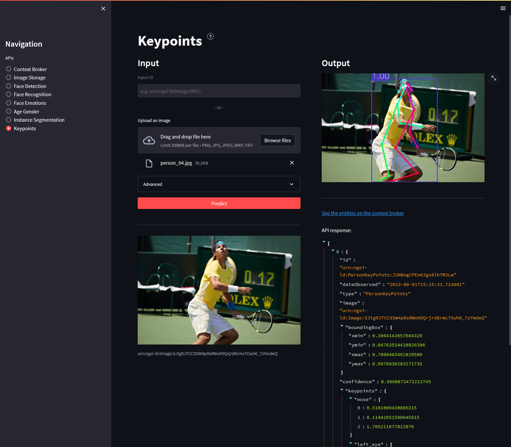

# Front End

This project offers a user-friendly web interface to interact with the Toolbox's APIs. It showcases the main components and services offered by the Toolbox, making it accessible to users regardless of their technical backgrounds. It is developed using the [Streamlit](https://streamlit.io/) Python library and includes a dedicated page for each of the Toolbox Projects. A dedicated page for the Context Broker is also included, which allows visualizing some real-time metrics and data.



## Configuration

This application uses a configuration YAML with the following fields:
- ``use_cookies``: If True the application will use cookies to store the state of the application.
- ``show_agreement``: If True, an agreement message related to the usage of images and cookies will be shown at the start of the application.
- ``agreement_text``: Path to the agreement text file.
- ``context_broker``:
    - ``host``: IP address of the Context Broker.
    - ``port``: Port of the Context Broker.
- ``image_storage``:
    - ``host``: IP address of the Image Storage API.
    - ``port``: Port of the Image Storage API.
    - ``url_path``: Base URL path of the Image Storage API.
- ``projects``: List of APIs to show on different pages.
    - ``name``: Title of the page/API.
    - ``port``: Port of the API.
    - ``host``: Host address of the API.
    - ``url_path``: Base URL path of the API.
    - ``description_path``: Path to a text file with a description of the API/Project.
    - ``template``: Name of the Python template class that will be used to display and interact with the API.
    - ``...``: Some additional parameters specific to each template class can be passed. See the constructor of each template for the full list of accepeted arguments.

<details>
<summary>Example:</summary>

```
common_host: &common_host
  127.0.0.1
pagination_limit: &pagination_limit
  30
context_broker_links: &context_broker_links
  True
use_cookies: True
show_agreement: True
agreement_text: res/texts/agreement.txt
context_broker:
  host: *common_host
  port: 1026
image_storage: &image_storage
  host: *common_host
  port: 9001
  url_path: /
projects:
  - name: Context Broker
    port: 1026
    host: *common_host
    pagination_limit: *pagination_limit
    url_path: /
    refresh_rate: 10 # seconds
    description_path: res/texts/context_broker.txt
    template: ContextBrokerTemplate
  - name: Image Storage
    template: ImageStorageTemplate
    pagination_limit: *pagination_limit
    context_broker_links: *context_broker_links
    description_path: res/texts/image_storage.txt
    <<: *image_storage
  - name: Face Detection
    port: 9007
    host: *common_host
    url_path: /
    description_path: res/texts/face_detection.txt
    template: SimplePredictTemplate
  - name: Face Recognition
    port: 9002
    host: *common_host
    url_path: /
    description_path: res/texts/face_recognition.txt
    template: FaceRecognitionTemplate
  - name: Face Emotions
    port: 9004
    host: *common_host
    url_path: /
    description_path: res/texts/face_emotions.txt
    template: SimplePredictTemplate
  - name: Age Gender
    port: 9003
    host: *common_host
    url_path: /
    description_path: res/texts/age_gender.txt
    template: SimplePredictTemplate
  - name: Instance Segmentation
    port: 9005
    host: *common_host
    url_path: /
    description_path: res/texts/instance_segmentation.txt
    template: SimplePredictTemplate
  - name: Keypoints
    port: 9006
    host: *common_host
    url_path: /
    description_path: res/texts/keypoints.txt
    template: SimplePredictTemplate
```

</details>
