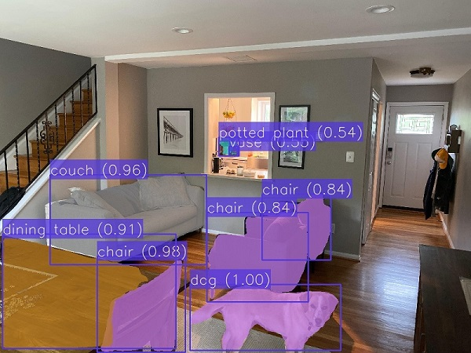

# Instance Segmentation

This Project aims to detect and segment objects in images.



## Data models

This project uses the _[InstanceSegmentation](https://github.com/CommuniCityProject/communicity_toolbox/tree/master/docs/DataModels/InstanceSegmentation)_ data model.

## Configuration

This project uses a configuration YAML with the following fields:

- ``instance_segmentation``: Specifies the name and parameters of the instance segmentation model. It must have the following fields:
  - ``model_name``: Name of the model.
  - ``params``: The parameters of the models' python class.
- ``context_broker``:
    - ``host``: IP address of the Context Broker.
    - ``port``: Port of the Context Broker.
    - ``notification_uri``: URI where the subscription notifications will be sent.
    - ``check_subscription_conflicts``: Flag if the subscription conflicts should be checked before creating them.
- ``api``:
    - ``host``: Bind IP address of the API server.
    - ``port``: Bind port of the API server.
    - ``allowed_origins``: List of origins that should be permitted to make cross-origin requests.
    - ``local_image_storage``: Flags if the images are stored locally and can be accessed by their path or must be retrieved from a URL.
- ``subscriptions``: List of subscriptions to create on the context broker. Each element can have the following fields:
    - ``entity_type``: Entity type to subscribe to.
    - ``watched_attributes``: List of attributes to subscribe to.
    - ``query``: Query to filter the entities to subscribe to.

<details>
<summary>Example:</summary>

```
instance_segmentation:
  model_name: detectron2
  params:
    model_config: ../../../data/models/detectron2/COCO-InstanceSegmentation/mask_rcnn_R_50_FPN_3x/mask_rcnn_R_50_FPN_3x.yaml
    model_weights: ../../../data/models/detectron2/COCO-InstanceSegmentation/mask_rcnn_R_50_FPN_3x/model_final_f10217.pkl
    confidence_threshold: 0.5
    use_cuda: True

context_broker:
  host: 192.168.0.100
  port: 1026
  notification_uri: http://192.168.0.100:8080/ngsi-ld/v1/notify
  check_subscription_conflicts: True

api:
  host: 0.0.0.0
  port: 8080
  allowed_origins: []
  local_image_storage: True

subscriptions:
  - entity_type: Image
    watched_attributes: ["purpose"]
    query: "purpose==%22InstanceSegmentation%22"
```

</details>


## API

The API allows the Project to be executed as a service. It has automatic and interactive documentation generated with [swagger-ui](https://github.com/swagger-api/swagger-ui) on ``/docs`` and [redoc](https://github.com/Redocly/redoc) on ``/redoc``.

### Endpoints

- **``GET``** _/_

    Returns the name and version of the API.

    - **Response**

      <details>
      <summary>application/json</summary>

      ```
      {
        "title": "Instance Segmentation API",
        "version": "0.2.0"
      }
      ```

    </details>

- **``POST``** _/predict_

    Predict bounding boxes and masks of the objects in an image. It returns a list of data models for each detected object. The response type can be specified with the ``accept`` header (``application/json`` or ``application/ld+json``).

    - **Request body**

      A JSON with the following fields:

      - ``entity_id``: The id of an image entity in the context broker to perform instance segmentation on.
      - ``post_to_broker``: Flag if the generated data models should be posted to the context broker. Defaults to ``true``.
    
      </br>
      <details>
      <summary>application/json</summary>

      ```
      {
        "entity_id": "string",
        "post_to_broker": true
      }
      ```

    </details>

    - **Response**
    
      A list with the generated data models (one for each person) with the following fields:

      - ``id``: The id of the entity on the context broker.
      - ``dateObserved``: The date when the data model was generated.
      - ``type``: The type of the data model (``InstanceSegmentation``).
      - ``image``: The id of the source image entity.
      - ``mask``: The mask of the object in the image (RLE compressed binary mask with hexadecimal encoding).
      - ``boundingBox``: The bounding box of the object in the image with relative image coordinates.
      - ``confidence``: The confidence of the detection.
      - ``label``: The label of the detected object.
      - ``labelId``: The label id of the detected object.

      </br>
      <details>
      <summary>application/json</summary>

      ```
      [
        {
          "id": "urn:ngsi-ld:InstanceSegmentation:wJm91OsuEe2QfbPVle6bQw",
          "dateObserved": "2023-05-05T10:22:34.964605",
          "type": "InstanceSegmentation",
          "image": "urn:ngsi-ld:Image:0Brlst7Mb2GuqiUQfFzBU409Xu9Y-LbdNkSAQG9xONk",
          "mask": {
            "size": [
              3024,
              4032
            ],
            "counts": "605b5065353d6c6d323a403e49374b354b344c344e324e324e324e324f314f324e314f314f314f3130304f314f31303030304f3130303030303030304f31303030314f3030303030303030303030303030303030303030303030303030303030303030303030303030303030303030314f30303030303030303030303030314f314f324d354c334d354b354a61305e4f6130594f5c6c666835"
          },
          "boundingBox": {
            "xmin": 0.4862205263168093,
            "ymin": 0.4151156390154803,
            "xmax": 0.5035785190642826,
            "ymax": 0.44116150386749753
          },
          "label": "vase",
          "labelId": 75,
          "confidence": 0.5476813316345215
        }
      ]
      ```
      </details>
    
      <details>
      <summary>application/ld+json</summary>

      ```
      [
        {
          "id": "urn:ngsi-ld:InstanceSegmentation:AW8wlusvEe2pN7PVle6bQw",
          "type": "InstanceSegmentation",
          "@context": [
            "https://uri.etsi.org/ngsi-ld/v1/ngsi-ld-core-context.jsonld"
          ],
          "dateObserved": {
            "type": "Property",
            "value": {
              "@type": "DateTime",
              "@value": "2023-05-05T10:24:23Z"
            }
          },
          "image": {
            "type": "Relationship",
            "object": "urn:ngsi-ld:Image:0Brlst7Mb2GuqiUQfFzBU409Xu9Y-LbdNkSAQG9xONk"
          },
          "mask": {
            "type": "Property",
            "value": {
              "size": [
                3024,
                4032
              ],
              "counts": "605b5065353d6c6d323a403e49374b354b344c344e324e324e324e324f314f324e314f314f314f3130304f314f31303030304f3130303030303030304f31303030314f3030303030303030303030303030303030303030303030303030303030303030303030303030303030303030314f30303030303030303030303030314f314f324d354c334d354b354a61305e4f6130594f5c6c666835"
            }
          },
          "boundingBox": {
            "type": "Property",
            "value": {
              "xmin": 0.4862205263168093,
              "ymin": 0.4151156390154803,
              "xmax": 0.5035785190642826,
              "ymax": 0.44116150386749753
            }
          },
          "label": {
            "type": "Property",
            "value": "vase"
          },
          "labelId": {
            "type": "Property",
            "value": 75
          },
          "confidence": {
            "type": "Property",
            "value": 0.5476813316345215
          },
          "dateModified": {
            "type": "Property",
            "value": {
              "@type": "DateTime",
              "@value": "2023-05-05T10:24:23Z"
            }
          },
          "dateCreated": {
            "type": "Property",
            "value": {
              "@type": "DateTime",
              "@value": "2023-05-05T10:24:23Z"
            }
          }
        }
      ]
      ```
      </details>

- **``POST``** _/ngsi-ld/v1/notify_
  
  Route to notify the activation of a subscription from a context broker.

  - **Query parameters**
    
    ``subscriptionId``: The id of the subscription.

  - **Request body**

      A JSON with the following fields:

      - ``id``: The id of the notification.
      - ``type``: ``Notification``.
      - ``subscriptionId``: The id of the subscription.
      - ``notifiedAt``: The date when the notification was sent.
      - ``data``: A list with the entities notified.
    
      </br>
      <details>
      <summary>application/json</summary>

      ```
      {
        "id": "string",
        "type": "Notification",
        "subscriptionId": "string",
        "notifiedAt": "string",
        "data": []
      }
      ```

    </details>

  - **Response**

    ``204`` _no content_: If the notification was processed successfully.