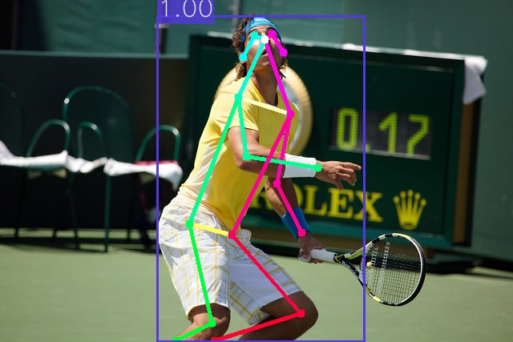

# Keypoints

This Project aims to detect body keypoints in images. Keypoints are the location of some body parts such as elbows, wrists or knees. This allows us to get an estimation of the pose of a person in a given image.



## Data models

This project uses the _[PersonKeyPoints](https://github.com/CommuniCityProject/communicity_toolbox/tree/master/docs/DataModels/PersonKeyPoints)_ data model.

## Configuration

This project uses a configuration YAML with the following fields:

- ``keypoints``: Specifies the name and parameters of the Keypoints detector model. It must have the following fields:
  - ``model_name``: Name of the model.
  - ``params``: The parameters of the models' python class.
- ``context_broker``:
    - ``host``: IP address of the Context Broker.
    - ``port``: Port of the Context Broker.
    - ``notification_uri``: URI where the subscription notifications will be sent.
    - ``check_subscription_conflicts``: Flag if the subscription conflicts should be checked before creating them.
- ``api``:
    - ``host``: Bind IP address of the API server.
    - ``port``: Bind port of the API server.
    - ``allowed_origins``: List of origins that should be permitted to make cross-origin requests.
    - ``local_image_storage``: Flags if the images are stored locally and can be accessed by their path or must be retrieved from a URL.
- ``subscriptions``: List of subscriptions to create on the context broker. Each element can have the following fields:
    - ``entity_type``: Entity type to subscribe to.
    - ``watched_attributes``: List of attributes to subscribe to.
    - ``query``: Query to filter the entities to subscribe to.

<details>
<summary>Example:</summary>

```
keypoints:
  model_name: detectron2
  params:
    model_config: ../../../data/models/detectron2/COCO-Keypoints/keypoint_rcnn_R_50_FPN_3x/keypoint_rcnn_R_50_FPN_3x.yaml
    model_weights: ../../../data/models/detectron2/COCO-Keypoints/keypoint_rcnn_R_50_FPN_3x/model_final_a6e10b.pkl
    confidence_threshold: 0.5
    use_cuda: False

context_broker:
  host: 192.168.0.100
  port: 1026
  notification_uri: http://192.168.0.100:8080/ngsi-ld/v1/notify
  check_subscription_conflicts: True

api:
  host: 0.0.0.0
  port: 8080
  allowed_origins: []
  local_image_storage: True

subscriptions:
  - entity_type: Image
    watched_attributes: ["purpose"]
    query: "purpose==%22Keypoints%22"
```

</details>

## API

The API allows the Project to be executed as a service. It has automatic and interactive documentation generated with [swagger-ui](https://github.com/swagger-api/swagger-ui) on ``/docs`` and [redoc](https://github.com/Redocly/redoc) on ``/redoc``.

### Endpoints

- **``GET``** _/_

    Returns the name and version of the API.

    - **Response**

      <details>
      <summary>application/json</summary>

      ```
      {
        "title": "Keypoints API",
        "version": "0.2.0"
      }
      ```

    </details>

- **``POST``** _/predict_

    Predict the keypoints of the persons in an image. It returns a list of data models with the keypoints of each person. The response type can be specified with the ``accept`` header (``application/json`` or ``application/ld+json``).

    - **Request body**

      A JSON with the following fields:

      - ``entity_id``: The id of an image entity in the context broker to predict the keypoints of.
      - ``post_to_broker``: Flag if the generated data models should be posted to the context broker. Defaults to ``true``.
    
      </br>
      <details>
      <summary>application/json</summary>

      ```
      {
        "entity_id": "string",
        "post_to_broker": true
      }
      ```

    </details>

    - **Response**
    
      A list with the generated data models (one for each person) with the following fields:

      - ``id``: The id of the entity on the context broker.
      - ``dateObserved``: The date when the data model was generated.
      - ``type``: The type of the data model (``PersonKeyPoints``).
      - ``image``: The id of the source image entity.
      - ``boundingBox``: The bounding box of the person in the image with relative image coordinates.
      - ``confidence``: The confidence of the detection.
      - ``keypoints``: The keypoints of the person in the image where each keypoint is a list of three elements (``[x, y, confidence]``) and the coordinates are relative to the image size.

      </br>
      <details>
      <summary>application/json</summary>

      ```
      [
        {
          "id": "urn:ngsi-ld:PersonKeyPoints:Ewr1pesuEe2xXt05bH~uyw",
          "dateObserved": "2023-05-05T10:17:43.886068",
          "type": "PersonKeyPoints",
          "image": "urn:ngsi-ld:Image:XY0r-VgvLkk3G908InXw815d7gtVrB72xqm0K844g6E",
          "boundingBox": {
            "xmin": 0.3064143657684326,
            "ymin": 0.04763534420826396,
            "xmax": 0.7099463462829589,
            "ymax": 0.9976930283271735
          },
          "confidence": 0.9998873472213745,
          "keypoints": {
            "nose": [
              0.5161009430885315,
              0.11442651599645615,
              1.705211877822876
            ],
            "left_eye": [
              0.530274510383606,
              0.09819689393043518,
              2.9264578819274902
            ],
            "right_eye": [
              0.4960910677909851,
              0.10319062322378159,
              0.9791589975357056
            ],
            "left_ear": [
              0.5519519448280334,
              0.15187951922416687,
              0.9948521256446838
            ],
            "right_ear": [
              0.4735800325870514,
              0.16561231017112732,
              2.086688995361328
            ],
            "left_shoulder": [
              0.5652918219566345,
              0.331653892993927,
              0.27620482444763184
            ],
            "right_shoulder": [
              0.4635750651359558,
              0.28421345353126526,
              0.20316766202449799
            ],
            "left_elbow": [
              0.5386120080947876,
              0.5363969206809998,
              0.4380761981010437
            ],
            "right_elbow": [
              0.48024994134902954,
              0.4564972221851349,
              1.025445580482483
            ],
            "left_wrist": [
              0.5878028869628906,
              0.6799667477607727,
              0.6801813244819641
            ],
            "right_wrist": [
              0.6186513900756836,
              0.49020493030548096,
              1.0798372030258179
            ],
            "left_hip": [
              0.4510689377784729,
              0.686208963394165,
              0.1246616467833519
            ],
            "right_hip": [
              0.3693620264530182,
              0.6537497043609619,
              0.08254871517419815
            ],
            "left_knee": [
              0.5861353874206543,
              0.9146721959114075,
              0.3097969591617584
            ],
            "right_knee": [
              0.41271671652793884,
              0.9446346163749695,
              0.37432464957237244
            ],
            "left_ankle": [
              0.41771912574768066,
              0.9945719242095947,
              0.06195808947086334
            ],
            "right_ankle": [
              0.3418484926223755,
              0.9945719242095947,
              0.08313852548599243
            ]
          }
        }
      ]
      ```
      </details>
    
      <details>
      <summary>application/ld+json</summary>

      ```
      [
        {
          "id": "urn:ngsi-ld:PersonKeyPoints:MhqTWesuEe2UVt05bH~uyw",
          "type": "PersonKeyPoints",
          "@context": [
            "https://uri.etsi.org/ngsi-ld/v1/ngsi-ld-core-context.jsonld"
          ],
          "dateObserved": {
            "type": "Property",
            "value": {
              "@type": "DateTime",
              "@value": "2023-05-05T10:18:35Z"
            }
          },
          "image": {
            "type": "Relationship",
            "object": "urn:ngsi-ld:Image:XY0r-VgvLkk3G908InXw815d7gtVrB72xqm0K844g6E"
          },
          "boundingBox": {
            "type": "Property",
            "value": {
              "xmin": 0.3064143657684326,
              "ymin": 0.04763534420826396,
              "xmax": 0.7099463462829589,
              "ymax": 0.9976930283271735
            }
          },
          "confidence": {
            "type": "Property",
            "value": 0.9998873472213745
          },
          "keypoints": {
            "type": "Property",
            "value": {
              "nose": [
                0.5161009430885315,
                0.11442651599645615,
                1.705211877822876
              ],
              "left_eye": [
                0.530274510383606,
                0.09819689393043518,
                2.9264578819274902
              ],
              "right_eye": [
                0.4960910677909851,
                0.10319062322378159,
                0.9791589975357056
              ],
              "left_ear": [
                0.5519519448280334,
                0.15187951922416687,
                0.9948521256446838
              ],
              "right_ear": [
                0.4735800325870514,
                0.16561231017112732,
                2.086688995361328
              ],
              "left_shoulder": [
                0.5652918219566345,
                0.331653892993927,
                0.27620482444763184
              ],
              "right_shoulder": [
                0.4635750651359558,
                0.28421345353126526,
                0.20316766202449799
              ],
              "left_elbow": [
                0.5386120080947876,
                0.5363969206809998,
                0.4380761981010437
              ],
              "right_elbow": [
                0.48024994134902954,
                0.4564972221851349,
                1.025445580482483
              ],
              "left_wrist": [
                0.5878028869628906,
                0.6799667477607727,
                0.6801813244819641
              ],
              "right_wrist": [
                0.6186513900756836,
                0.49020493030548096,
                1.0798372030258179
              ],
              "left_hip": [
                0.4510689377784729,
                0.686208963394165,
                0.1246616467833519
              ],
              "right_hip": [
                0.3693620264530182,
                0.6537497043609619,
                0.08254871517419815
              ],
              "left_knee": [
                0.5861353874206543,
                0.9146721959114075,
                0.3097969591617584
              ],
              "right_knee": [
                0.41271671652793884,
                0.9446346163749695,
                0.37432464957237244
              ],
              "left_ankle": [
                0.41771912574768066,
                0.9945719242095947,
                0.06195808947086334
              ],
              "right_ankle": [
                0.3418484926223755,
                0.9945719242095947,
                0.08313852548599243
              ]
            }
          },
          "dateModified": {
            "type": "Property",
            "value": {
              "@type": "DateTime",
              "@value": "2023-05-05T10:18:36Z"
            }
          },
          "dateCreated": {
            "type": "Property",
            "value": {
              "@type": "DateTime",
              "@value": "2023-05-05T10:18:36Z"
            }
          }
        }
      ]
      ```
      </details>

- **``POST``** _/ngsi-ld/v1/notify_
  
  Route to notify the activation of a subscription from a context broker.

  - **Query parameters**
    
    ``subscriptionId``: The id of the subscription.

  - **Request body**

      A JSON with the following fields:

      - ``id``: The id of the notification.
      - ``type``: ``Notification``.
      - ``subscriptionId``: The id of the subscription.
      - ``notifiedAt``: The date when the notification was sent.
      - ``data``: A list with the entities notified.
    
      </br>
      <details>
      <summary>application/json</summary>

      ```
      {
        "id": "string",
        "type": "Notification",
        "subscriptionId": "string",
        "notifiedAt": "string",
        "data": []
      }
      ```

    </details>

  - **Response**

    ``204`` _no content_: If the notification was processed successfully.